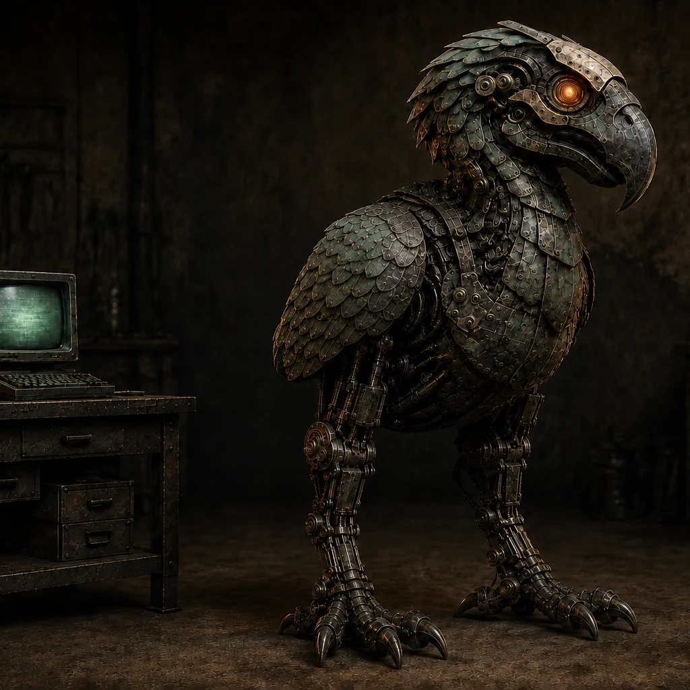

# MurderBird: Uncaged

**One inherited body. Three eras. An interactive mechanical-creature exhibit.**



**[Enter the exhibit](https://okhp3.github.io/murderbird-uncaged/)** · **[Read the origin story](https://overkillhill.com/writings/murderbird/)**

Meet a flightless mechanical creature whose construction changes across centuries. Orbit its enclosure, operate the Maker's external controls, engage the Mechanic's limited walking routine, and encounter the Advanced bird's attention, strikes, jump, and shield thrust. Open its assemblies to explore the machinery beneath the armor.

**Version 37 is the current production package.** It presents the latest assembled mechanical bird with three era-specific movement systems, reversible inspection, and matching fixed-view fallbacks. The banner is reference artwork, not a screenshot. Further likeness refinement remains possible; publication is not a claim of validated engineering.

## Three eras, three ways to move

| Era | What you can do | Construction |
| --- | --- | --- |
| **I · Maker** | Operate the leg, wing, tail, neck, and jaw controls. The supported body stays anchored. | External levers, rods, and lines; no autonomous movement or internal powered system. |
| **II · Mechanic** | Wind and engage a slow routine of short steps, pauses, and segmented turns. | A proposed spring, reduction-gear, and cam transmission with finite stored energy. |
| **III · Advanced** | Observe pacing and attention, choose a position at the rail, reach and retreat, or trigger a power jump and shield thrust. | Coordinated actuators, sensing, processing, and a separate fictional power supply. |

The wings are flightless guards for balance and shielding. The repaired anatomical left shoulder retains limited travel. New hidden mechanisms are proposed reconstructions. Current exhibit directions and the original story are recorded separately where they differ.

## Explore the exhibit

- **Look around:** drag to orbit; scroll or pinch to zoom. Camera buttons and keyboard controls are also available.
- **Choose an era:** the controls, movement, and visible construction change together.
- **Look inside:** open for inspection, select an assembly, center it, and adjust separation. Reassemble to return to the encounter.
- **Control the experience:** pause, reduce motion, toggle labels, and choose whether to start sound. Iron Verdict plays only after you press Play.
- **Without WebGL:** an illustrated view preserves era-specific explanations; it does not simulate the full 3D encounter.

The [story and media folio](https://okhp3.github.io/murderbird-uncaged/folio.html) preserves the illustrated narrative, motion study, and earlier model context. The **main exhibit above is the current interactive implementation**; the folio's earlier construction study is historical context.

## Current production source

[Version 37 release record](docs/production-v37.md) identifies the editable Blender model, exact GLB, browser fallbacks, and validation. Construction is rigid and motion is kinematic. The current model uses neutral mechanical surfaces; it does not claim final reference-matched materials or physical collision simulation.

## One release source

**GitHub `main` is the integration and deployment source.** GitHub Actions builds the current exhibit and story folio together and publishes one GitHub Pages artifact.

- [Build checks](https://github.com/OKHP3/murderbird-uncaged/actions/workflows/validate.yml)
- [Pages deployment](https://github.com/OKHP3/murderbird-uncaged/actions/workflows/deploy.yml)
- [Live release manifest](https://okhp3.github.io/murderbird-uncaged/release.json): exact source revision and SHA-256 hashes for the published files.
- [Release and reconciliation guide](docs/release-source-of-truth.md)

A local preview is a checkout, not a second authority. Replit is development preview only. Other machines and Replit must verify their own commit against `origin/main`; this repository does not imply that an inaccessible checkout is synchronized.

## Run locally

Use a supported Node.js version from `package.json`, Python 3, and Git LFS for the model and media files.

```sh
git lfs install
git lfs pull
npm ci
npm run dev -- --host 127.0.0.1
```

Create and inspect the production release:

```sh
npm run build
node --test tests/*.test.mjs
node scripts/verify-theme-release.mjs
node scripts/verify-publication.mjs
node scripts/verify-presentation.mjs
python3 scripts/verify-media-import.py
npm run preview -- --host 127.0.0.1
```

`npm run build` includes the manifest-selected review gallery and writes `dist/release.json`. Local modified builds are marked as such. The publication verifier checks emitted media and file hashes. CI retrieves LFS objects and validates Node 24 and 26. See the [technology inventory](docs/technology-stack.md) for maintenance details.

The application uses **Vite, Three.js, and Web Audio**, with no application backend. Existing Google Analytics is loaded by the page; audio remains visitor-controlled. Do not put credentials or private files into browser assets.

## Sources, privacy, and ownership

This is the canonical repository for MurderBird creative production and the interactive exhibit. The published original story remains on OverKill Hill. FoundRy is an incubation/routing space, and Replit is a preview environment.

| Location | Purpose |
| --- | --- |
| `src/` | Active exhibit, era movement, folio, and audio code |
| `assets/models/` | Versioned editable models, exports, maps, and preview renders |
| `assets/murderbird/`, `assets/img/` | Preserved creative sources and production history |
| `content/story/` | Provenance-linked story snapshots; not a live-page claim |
| `docs/`, `provenance/` | Requirements, decisions, source lineage, and validation boundaries |
| `public/` | Deliberately approved browser-delivered files |
| `.local/` | Ignored private archives and machine-local verification |

Original names, source trees, and historical candidates are preserved. Only explicit runtime references and the reviewed publication allowlist enter the website build. Private session archives are never staged or published. Read the [repository boundaries](docs/repository-boundaries.md), [asset guide](assets/README.md), [media catalog](docs/media-catalog.md), and [agent guidance](AGENTS.md) before contributing.

## License and credits

Created and directed by **Jamie Hill / OverKill Hill P³**.

**Code:** [MIT](LICENSE). **MurderBird creative content:** all rights reserved, including the character, likeness, story, imagery, models, music, and lyrics. The code license does not grant reuse rights to the creature. See [NOTICE.md](NOTICE.md).
