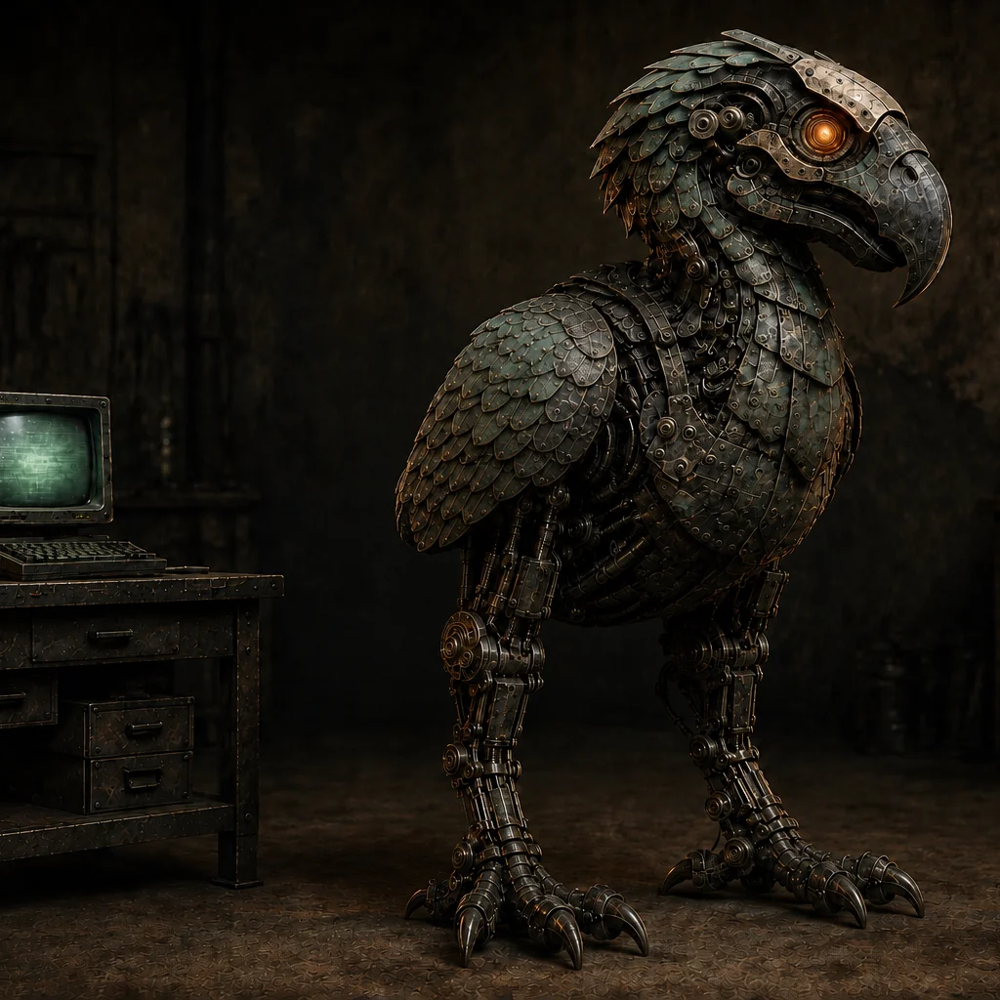

# MurderBird: Uncaged

**Current shared goal:** read the root-level [goal.md](goal.md) before assigning, reviewing or starting work. Its YAML front matter records `last_updated`; use GitHub `main` for the latest shared revision. Cross-system review record: [issue #14](https://github.com/OKHP3/murderbird-uncaged/issues/14) (closed).

> **Status (November 13, 2026): complete as a study, frozen at v1.0.** The exhibit, story, song and sources are finished and preserved. Final character likeness was not achieved and is not claimed; that work is parked. See the [closeout receipt](records/handoffs--project-closeout-2026-11-13.md).

> **Final (November 27, 2026): v1.1 is the final release.** The owner kept v1.1 final. The First Choice · Advanced candidate in [`atelier/`](atelier/) is published as a documented study and is not part of the exhibit. See the [goal](goal.md) and the [First Choice record](records/handoffs--first-choice-thread-closeout-2026-11-27.md).

> **Added November 14, 2026: [Living Plates](records/living-plates.md).** The pinned reference art as four look-around plates in `public/plates/`. It is the reference art with estimated depth, not a model, and it leaves the parked likeness status unchanged.

**One inherited body. Three eras. An interactive mechanical-creature exhibit.**



**[Assess the latest CG character](https://okhp3.github.io/murderbird-uncaged/cg.html)** · **[Enter the interactive exhibit](https://okhp3.github.io/murderbird-uncaged/)** · **[Read the origin story](https://overkillhill.com/writings/murderbird/)**

Meet a flightless mechanical creature whose construction changes across centuries. Orbit its enclosure, operate the Maker's external controls, engage the Mechanic's limited walking routine, and encounter the Advanced bird's attention, strikes, jump, and shield thrust. Open its assemblies to explore the machinery beneath the armor.

**Two selected packages are retained:** the static CG assessment and the V37 interactive movement exhibit. Their editable sources, usable exports, receipts and acceptance limits are listed under [Selected deliverables](#selected-deliverables). The banner is reference artwork.

## Three eras, three ways to move

| Era | What you can do | Construction |
| --- | --- | --- |
| **I · Maker** | Operate the leg, wing, tail, neck, and jaw controls. The supported body stays anchored. | External levers, rods, and lines; no autonomous movement or internal powered system. |
| **II · Mechanic** | Wind and engage a slow routine of short steps, pauses, and segmented turns. | A proposed spring, reduction-gear, and cam transmission with finite stored energy. |
| **III · Advanced** | Observe pacing and attention, choose a position at the rail, reach and retreat, or trigger a power jump and shield thrust. | Coordinated actuators, sensing, processing, and a separate fictional power supply. |

The wings are flightless guards for balance and shielding. The repaired anatomical left shoulder retains limited travel. New hidden mechanisms are proposed reconstructions. Current exhibit directions and the original story are recorded separately where they differ.

## Explore the exhibit

- **Look around:** drag to orbit; scroll or pinch to zoom. Camera buttons and keyboard controls are also available.
- **Choose an era:** the controls, movement, and visible construction change together.
- **Look inside:** open for inspection, select an assembly, center it, and adjust separation. Reassemble to return to the encounter.
- **Control the experience:** pause, reduce motion, toggle labels, and choose whether to start sound. Iron Verdict plays only after you press Play.
- **Without WebGL:** an illustrated view preserves era-specific explanations; it does not simulate the full 3D encounter.

The [story and media folio](https://okhp3.github.io/murderbird-uncaged/folio.html) preserves the illustrated narrative, motion study, and earlier model context. The **main exhibit above is the current interactive implementation**; the folio's earlier construction study is historical context.

## Selected deliverables

Every shipped file lives flat in [`media/`](media/). Earlier iterations, renders and receipts are kept in Git history at tag [`archive/pre-flatten-2026-11-19`](https://github.com/OKHP3/murderbird-uncaged/tree/archive/pre-flatten-2026-11-19).

| Package | Editable native | Usable export / evidence | Current status |
|---|---|---|---|
| CG Maker, retained04 | [Blender source](media/cg-retained04-maker-murderbird-recursive-maker.blend) | [GLB](media/cg-retained04-maker-murderbird-recursive-maker.glb), [native views and receipt](https://github.com/OKHP3/murderbird-uncaged/tree/archive/pre-flatten-2026-11-19/assets/audit/cg-recursive-three-loop01/loop03/delivery/retained04/maker) | Static assessment; no skins or animations. |
| CG Mechanic, retained04 | [Blender source](media/cg-retained04-mechanic-murderbird-recursive-mechanic.blend) | [GLB](media/cg-retained04-mechanic-murderbird-recursive-mechanic.glb), [native views and receipt](https://github.com/OKHP3/murderbird-uncaged/tree/archive/pre-flatten-2026-11-19/assets/audit/cg-recursive-three-loop01/loop03/delivery/retained04/mechanic) | Static assessment; no skins or animations. |
| CG Advanced, retained04 (source folder: builder) | [Blender source](media/cg-retained04-builder-murderbird-recursive-builder.blend) | [GLB](media/cg-retained04-builder-murderbird-recursive-builder.glb), [native views and receipt](https://github.com/OKHP3/murderbird-uncaged/tree/archive/pre-flatten-2026-11-19/assets/audit/cg-recursive-three-loop01/loop03/delivery/retained04/builder) | Static assessment; no skins or animations. |
| V37 interactive exhibit | [Blender source](media/v37-murderbird-whole-character.blend) | [GLB](media/v37-murderbird-whole-character.glb), [era previews and package](https://github.com/OKHP3/murderbird-uncaged/tree/archive/pre-flatten-2026-11-19/assets/models/whole-character-v37/attempt-release02), [release record](records/production-v37.md) | Owner-authorized exhibit with kinematic movement, inspection, sound and illustrated fallbacks. |
| Living Plates | Pinned reference images, unchanged | [Page and layers](public/plates/), [authoring script](scripts/build-living-plates.py), [record](records/living-plates-2026-11-14.json) | Reference art with estimated depth and a five-degree look-around. Not a model. |
| First Choice · Advanced study | Built on the Mac Studio from the retained04 Advanced native; the native `first-choice.blend` is recorded by hash in the [study record](records/handoffs--first-choice-thread-closeout-2026-11-27.md) | [Offline viewer with the GLB embedded](atelier/runtime/.qa/First-Choice-portable.html), [integration notes](atelier/delivery/integration.md), [rebuild steps](atelier/delivery/rebuild.md) | Documented acting study, 10.5 s. Not in the exhibit; likeness not accepted. |

The [CG selection manifest](media/cg-publication.json) and [V37 runtime manifest](media/production-v37.json) pin the browser assets. The [CG import ledger](records/cg-production-import-2026-10-04.json) and [release handoff](records/handoffs--cg-production-release-2026-10-04-01.md) retain source paths, hashes and delivery evidence. Public copies are generated only from those explicit selections.

These are selected deliverables, not final artistic acceptance. CG source likeness remains **UNMET**, owner acceptance **NOT GIVEN** (parked on November 13; v1.1 kept final on November 27), and strict native/export normal parity remains **FAIL** at **2e-5** ([diagnosis](https://github.com/OKHP3/murderbird-uncaged/blob/archive/pre-flatten-2026-11-19/assets/audit/delegation-series-2026-10-05/packets/mb-p04/normal-diagnosis.json)). The CG candidate retains shorter breast courses, local underlaps, articulated toe detail and a restrained crown finish change. V37 remains the separate movement exhibit; construction is rigid, motion is kinematic, and physical engineering is not established.

For story, artwork, audio and historical source packages, use the [media catalog](records/media-catalog.md). Historical variants and their source refs remain recoverable; do not promote them by age or filename. Machine-local recovery archives and worktree ownership records belong outside publication paths. The verified owner staging archive is separate from this repository and is not an independent backup. Repository navigation or tracked-file cleanup does not purge hosted Git LFS objects.

## One release source

**GitHub `main` is the integration and deployment source.** GitHub Actions builds the current exhibit and story folio together and publishes one GitHub Pages artifact.

- [Build checks](https://github.com/OKHP3/murderbird-uncaged/actions/workflows/validate.yml)
- [Validated Pages deployment](https://github.com/OKHP3/murderbird-uncaged/actions/workflows/validate.yml)
- [Live release manifest](https://okhp3.github.io/murderbird-uncaged/release.json): exact source revision and SHA-256 hashes for the published files.
- [Release and reconciliation guide](records/release-source-of-truth.md)

While the LFS budget is exhausted, the manual [overlay publication](records/living-plates.md#publishing-while-the-lfs-budget-is-exhausted) can add `public/plates/` to the live site without rebuilding it. It republishes every other file unchanged after verifying it against the live manifest.

A local preview is a checkout, not a second authority. Replit is development preview only. Other machines and Replit must verify their own commit against `origin/main`; this repository does not imply that an inaccessible checkout is synchronized.

## Run locally

Use a supported Node.js version from `package.json` and Git LFS for the files in `media/`.

```sh
git lfs install
git lfs pull --include="media/*,public/audio/**"
npm ci
npm run dev -- --host 127.0.0.1
```

Create and inspect the production release:

```sh
npm run build
node --test tests/*.test.mjs
node scripts/verify-theme-release.mjs
node scripts/verify-publication.mjs
node scripts/verify-presentation.mjs
npm run preview -- --host 127.0.0.1
```

`npm run build` copies the manifest-selected CG views into `public/cg/` and writes `dist/release.json`. Pushes and pull requests run the unit tests only; a manual **Validate** run with `publish_pages` fetches `media/`, builds, verifies and deploys. See the [technology inventory](records/technology-stack.md) for maintenance details.

The application uses **Vite, Three.js, and Web Audio**, with no application backend. Existing Google Analytics is loaded by the page; audio remains visitor-controlled. Do not put credentials or private files into browser assets.

## Repository layout

This is the canonical repository for MurderBird creative production and the interactive exhibit. The published original story remains on OverKill Hill. FoundRy is an incubation/routing space, and Replit is a preview environment.

The tree was flattened on November 19, 2026: no folder is more than two levels deep outside `src/`, `public/` and `.agents/`.

| Location | Purpose |
| --- | --- |
| `index.html`, `folio.html`, `cg.html` | The exhibit, story folio and CG assessment pages |
| `src/` | Exhibit, era movement, folio and audio code |
| `public/` | Files served as-is, including Living Plates and the Iron Verdict release |
| `media/` | Every shipped model, render, image, video and track, plus the art library (`art-*`), in one flat folder. `cg-publication.json` and `production-v37.json` pin them by SHA-256 |
| `records/` | Goals history, decisions, handoffs (`handoffs--*`), provenance ledgers, story snapshots and research, flat |
| `scripts/` | Build, verification and Living Plates authoring only |
| `tests/` | Unit tests for the exhibit code |
| `.local/` | Ignored private archives and machine-local verification |

Earlier model versions, audit renders, study scripts and review packets were retired from `main` and remain in Git history at tag [`archive/pre-flatten-2026-11-19`](https://github.com/OKHP3/murderbird-uncaged/tree/archive/pre-flatten-2026-11-19). The full old-to-new path map is [records/flatten-map-2026-11-19.csv](records/flatten-map-2026-11-19.csv). Private session archives are never staged or published. Read the [repository boundaries](records/repository-boundaries.md), [media catalog](records/media-catalog.md) and [agent guidance](AGENTS.md) before contributing.

## License and credits

Created and directed by **Jamie Hill / OverKill Hill P³**.

**Code:** [MIT](LICENSE). **MurderBird creative content:** all rights reserved, including the character, likeness, story, imagery, models, music, and lyrics. The code license does not grant reuse rights to the creature. See [NOTICE.md](NOTICE.md).
